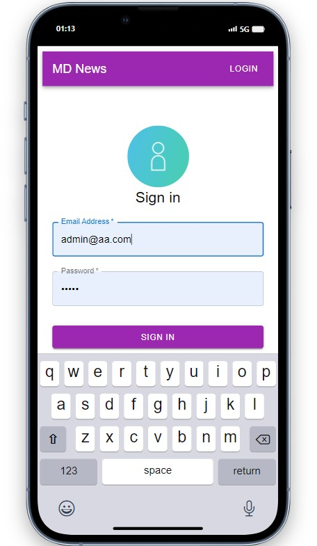
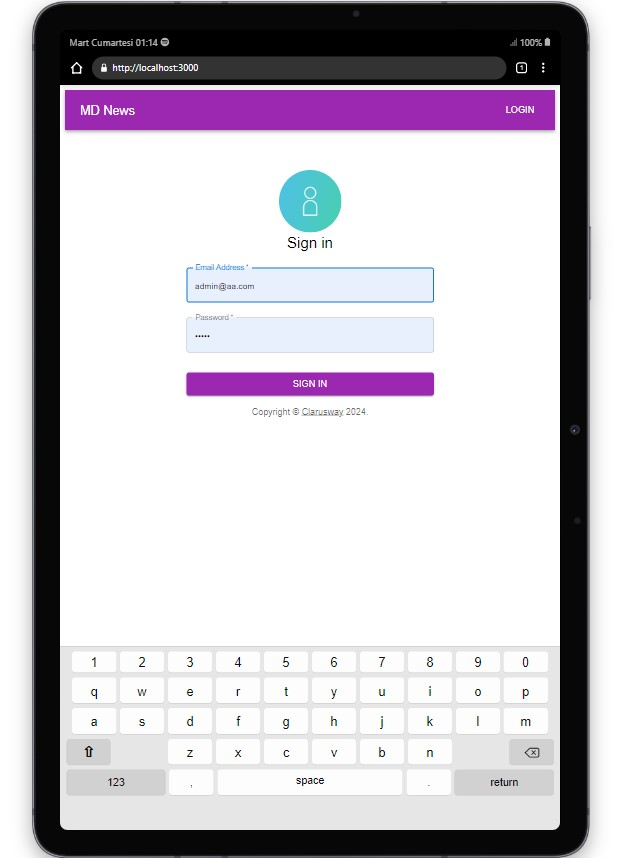
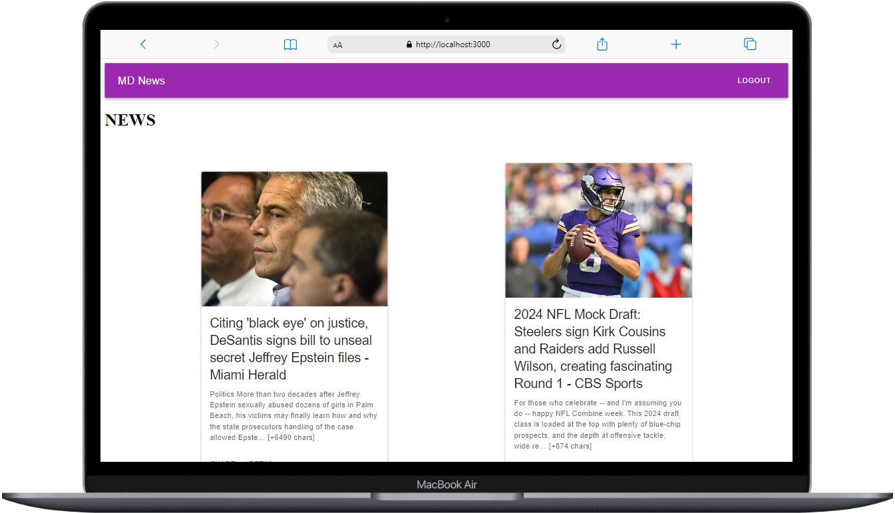

# MD NEWS

  

## About the Project

This project, created with react redux toolkit, is an application that shows world news and can be logged in easily with e-mail and password. You can find the source of the news by pressing the detail button in the news.

## Table of Contents

- [Technologies Used](#technologies-used)
- [Usage](#usage)
- [Used Libraries](#UsedLibraries)
- [Screenshots](#screenshots)

## Live Demo

[MD NEWS](https://react-redux-toolkit-work.vercel.app/login)

##  Used Libraries
- @reduxjs/toolkit
- react-redux
- axios
- react-router-dom
- @mui/material-ui
- @emotion/react
- @emotion/styled

## Used API:
https://newsapi.org/
(Click on the "Get Key" button to obtain the API key)

## Usage

- Enter your email and password
- You can look at the news you want and go to the detail page.
- You can log out.

## Screenshots

  
  
  

## Compatibility

The project is compatible with both wide-screen computers and mobile devices.